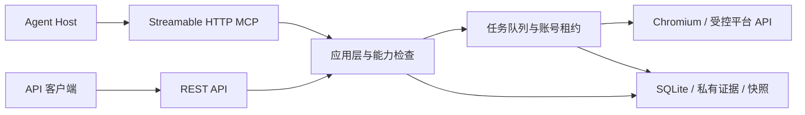

# 架构说明

`src/index.ts` 加载配置并启动 HTTP 服务。MCP 和 REST 共用 `src/application.ts` 的工具、任务队列和 SQLite 存储，平台访问由独立 Chromium 会话及受控 API 适配器完成。

## 主要目录

| 模块                       | 职责                                          |
| -------------------------- | --------------------------------------------- |
| `src/transport/`           | HTTP 鉴权、请求限制、REST 路由和 MCP 工具投影 |
| `src/application.ts`       | 工具 schema、能力开关、任务派发与公共响应     |
| `src/runtime/jobs.ts`      | 读取/写入队列、任务状态、取消与持久结果       |
| `src/runtime/store.ts`     | SQLite、幂等记录、manifest、证据与恢复校验    |
| `src/platform/`            | 平台读取、浏览器会话及原生草稿操作和证明合同  |
| `src/service-lifecycle.ts` | 关闭、信号处理与租约丢失时退出                |

## 读取与历史

实时读取记录来源时间、分页覆盖和完整性。只有完整数据集才能推进相应 current 指针；四数据集账号刷新还要求共同的任务来源。部分失败保留尝试证据与旧完整快照。

历史接口从本地存储返回 `sourceMode=saved`，不访问平台，也不把查询时间改为采集时间。普通任务、历史与回执接口只返回安全投影，原生完整正文由专用出口提供。

## 写入与恢复

写入需要开关、实际能力、目标身份和前置版本检查。幂等键与请求意图绑定；持久记录在平台副作用前建立。保存响应后仍需要独立回读核验，ACK 本身不能证明成功。

响应丢失、清理失败或回读无法确认时保留未知状态。对账读取已有目标并闭合证据，不重放保存；创建后的恢复与修复沿稳定分配目标和既有链条推进。

## 信任边界

API Bearer Token、平台会话、正文和证据文件属于私有后端数据。MCP 和 REST 使用服务鉴权、请求 Host/Origin 限制和公共响应投影。服务 Token 应通过客户端私有配置提供，不放入 URL 或前端资源。

备份包含平台会话及完整私有证据，必须按凭据级别保护。公开源码和构建上下文应排除全部运行数据，详见[安全策略](../SECURITY.md)。

## 后续工作台接入

工作台归属 xiaoshuo。未来由其后端调用本服务 REST API，并向前端提供安全结果，服务 Token 仅由后端持有。本仓不包含工作台 UI 或代理模块；该跨项目接入尚未实现。MCP 与 REST 继续在同一进程共享业务、浏览器和存储。
